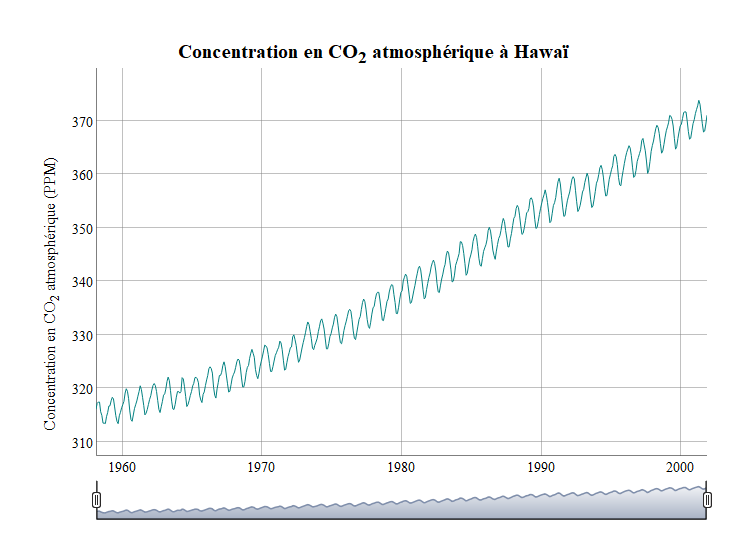
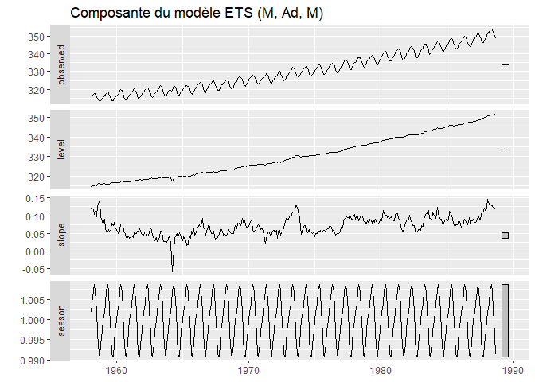
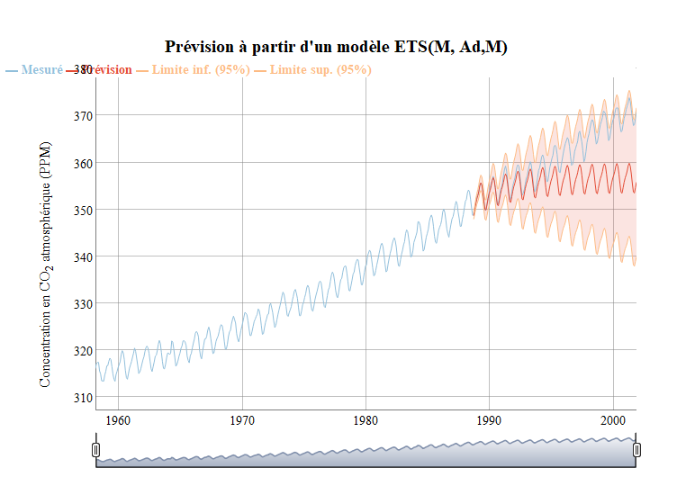
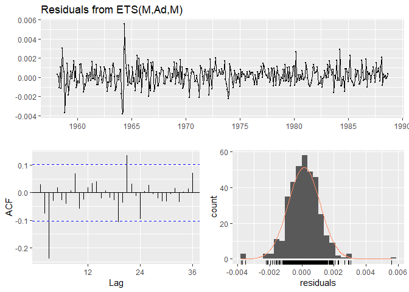
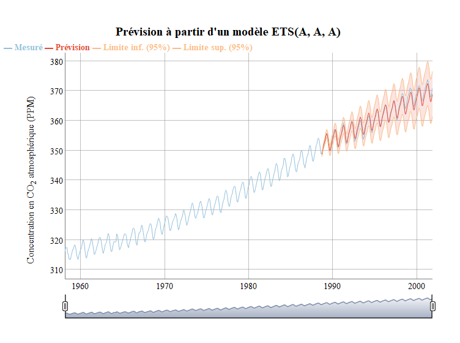
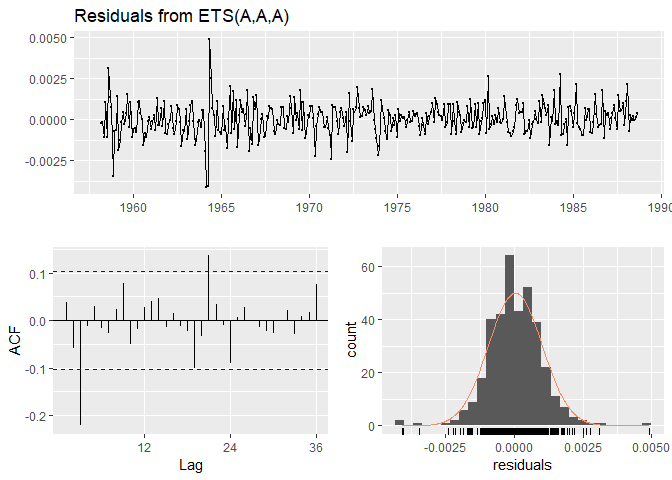

Devoir 5: Séries temporelles et reproductibilité
================
Cédric Bouffard
2019-04-03

# Préparation de la session R

La première étape est de charger les modules requis pour l’analyse.

``` r
library(tidyverse)
library(forecast)
library(dygraphs)
```

# Charger le fichier

On charge ensuite les données.

``` r
hawai <- read_csv("donnees/hawai.csv")
```

# Créer une série temporelle

Nous allons crérer la série temporelle en débutant en 1958. Puisque
`1958.0` correspond à Janvier 1958, la valeur minimale de la série
temporelle 1958.1666667 correspond à mars 1958.

``` r
hawai_ts <- ts(hawai[, -1], start = c(1958, 3), frequency = 12)
```

Vérifions la série temporelle sous frome de
graphique.

``` r
dygraph(hawai_ts, main = "Concentration en CO<sub>2</sub> atmosphérique à Hawaï") %>%
  dyAxis("y", label = "Concentration en CO<sub>2</sub> atmosphérique (PPM)") %>%
  dyRangeSelector()
```

<!-- -->

La forme de la courbe correspond à ce que nous attendions.

# Séparer les données en parties d’entraînement et de test

Nous allons maintenant créer un modèle qui va prévoir les valeurs de
CO<sub>2</sub> du 30% des dates situées à la fin de la série temporelle
à l’aide des valeurs précédentes.

Nous commençons par séparer les données en deux ensembles soit
l’ensemble d’entraînement `hawai_ts_train` et l’ensemble de test
`hawai_ts_test`.

``` r
hawai_ts_train <- window(hawai_ts, start = min(hawai$time), end = hawai$time[round(.7 * length(hawai_ts))] - .001)
hawai_ts_test <- window(hawai_ts, start = hawai$time[round(.7 * length(hawai_ts))])
```

Nous allons maintenant modéliser la série temporelle en utilisant un
modèle ETS.

``` r
hawai_model <- ets(hawai_ts_train)
hawai_model
```

    ## ETS(M,Ad,M) 
    ## 
    ## Call:
    ##  ets(y = hawai_ts_train) 
    ## 
    ##   Smoothing parameters:
    ##     alpha = 0.6454 
    ##     beta  = 0.0346 
    ##     gamma = 1e-04 
    ##     phi   = 0.9762 
    ## 
    ##   Initial states:
    ##     l = 314.6519 
    ##     b = 0.1205 
    ##     s = 1.0018 0.9999 0.9972 0.994 0.9907 0.9913
    ##            0.9964 1.0023 1.0068 1.0086 1.0071 1.0039
    ## 
    ##   sigma:  0.001
    ## 
    ##      AIC     AICc      BIC 
    ## 1390.791 1392.756 1461.087

Le modèle retenu est un `ETS(M,Ad,M)`. Nous avons une erreur de type `M`
(multiplicative), une tendance de type `Ad` (additive) et une saison de
type `M` (multiplicative).

``` r
autoplot(hawai_model) + ggtitle("Composante du modèle ETS (M, Ad, M)")
```

<!-- -->

On remarque aisément que le `level` augmente avec le temps. Regardons la
prévision en format
graphique.

``` r
hawai_pred <- hawai_model %>% forecast(h = length(hawai_ts_test), level = 95)
tout <- cbind(
  "Mesuré" = hawai_ts,
  inferieur = hawai_pred$lower,
  inferieur2 = hawai_pred$lower,
  superieur = hawai_pred$upper,
  superieur2 = hawai_pred$upper,
  "Prévision" = hawai_pred$mean)

dygraph(tout, main = "Prévision à partir d'un modèle ETS(M, Ad,M)") %>%
  dySeries("Mesuré", label = "Mesuré") %>%
  dySeries(c("inferieur", "Prévision", "superieur"), label = "Prévision") %>%
  dySeries("inferieur2", label = "Limite inf. (95%)") %>%
  dySeries("superieur2", label = "Limite sup. (95%)") %>%
  dyAxis("y", label = "Concentration en CO<sub>2</sub> atmosphérique (PPM)") %>%
  dyRangeSelector() %>%
  dyOptions(colors = c("#91bfdb", "#e34a33", "#fdbb84", "#fdbb84")) %>%
  dyLegend(width = 700)
```

<!-- -->

Sur le graphique, on remarque que la saisonnalité est bien respectée,
mais la tendance globale est sous-estimé. La mesure mesuré suit la
limite supérieur de l’intervalle de confiance à 95%. Regardons l’analyse
d’exactitude ainsi que les
    résidus.

``` r
accuracy(hawai_pred, hawai_ts_test)
```

    ##                      ME      RMSE      MAE        MPE       MAPE      MASE
    ## Training set 0.04915761 0.3278353 0.246988 0.01460441 0.07508167 0.2028074
    ## Test set     5.50794684 7.3497953 5.518228 1.50400529 1.50691402 4.5311414
    ##                   ACF1 Theil's U
    ## Training set 0.0268429        NA
    ## Test set     0.9817924  5.691226

On voit que la performance du modèle est largement inférieur avec
l’ensemble de test que celui d’entrainement. C’est évaluation concorde
avec la validation visuelle effectuée sur le graphique.

``` r
checkresiduals(hawai_model)
```

<!-- -->

    ## 
    ##  Ljung-Box test
    ## 
    ## data:  Residuals from ETS(M,Ad,M)
    ## Q* = 46.726, df = 7, p-value = 6.311e-08
    ## 
    ## Model df: 17.   Total lags used: 24

On voit qu’il existe probablement une structure dans les résidus qui
indiquerait qu’ils diffèrent d’un bruit blanc. On voit aussi que la
distribution des résidus semble un peu trop concentré au centre de la
distirbution.

Essayons d’effectuer une transformation logarithmique sur les données
afin d’améliorer la performance.

``` r
hawai_model_log <- hawai_ts_train %>% ets(lambda = 0)

hawai_pred_log <- hawai_model_log %>% forecast(h = length(hawai_ts_test), level = 95)
tout <- cbind(
  "Mesuré" = hawai_ts,
  inferieur = hawai_pred_log$lower,
  inferieur2 = hawai_pred_log$lower,
  superieur = hawai_pred_log$upper,
  superieur2 = hawai_pred_log$upper,
  "Prévision" = hawai_pred_log$mean)

dygraph(tout, main = "Prévision à partir d'un modèle ETS(A, A, A)") %>%
  dySeries("Mesuré", label = "Mesuré") %>%
  dySeries(c("inferieur", "Prévision", "superieur"), label = "Prévision") %>%
  dySeries("inferieur2", label = "Limite inf. (95%)") %>%
  dySeries("superieur2", label = "Limite sup. (95%)") %>%
  dyAxis("y", label = "Concentration en CO<sub>2</sub> atmosphérique (PPM)") %>%
  dyRangeSelector() %>%
  dyOptions(colors = c("#91bfdb", "#e34a33", "#fdbb84", "#fdbb84")) %>%
  dyLegend(width = 700)
```

<!-- -->

``` r
accuracy(hawai_pred_log, hawai_ts_test)
```

    ##                     ME      RMSE       MAE         MPE       MAPE
    ## Training set 0.0138282 0.3197608 0.2413485 0.003786366 0.07338496
    ## Test set     0.2483824 0.9843718 0.7658390 0.065652014 0.21049415
    ##                   MASE      ACF1 Theil's U
    ## Training set 0.1981767 0.0357710        NA
    ## Test set     0.6288477 0.9376222  0.767364

On voit que cette transformation a grandement améliorer la performance
du modèle.

``` r
checkresiduals(hawai_model_log)
```

<!-- -->

    ## 
    ##  Ljung-Box test
    ## 
    ## data:  Residuals from ETS(A,A,A)
    ## Q* = 42.1, df = 8, p-value = 1.297e-06
    ## 
    ## Model df: 16.   Total lags used: 24

Au niveau des résidus, il semble rester une structure non capté par le
modèle.

# Comment améliorer le modèle

Pour améliorer le modèle, on pourrait tester d’autres valeurs de
`lambda`. On pourrait aussi essayer d’inclure des covariables
(température, humidité, population) qui pourrait aider à la prévision.
